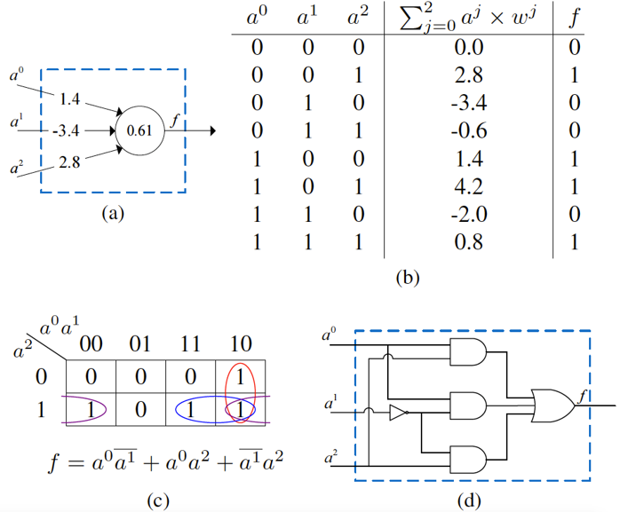

#  USC CSCI 596 Final Project -- Espresso-GPU

| USCID      | Email            | Name        |
| ---------- | ---------------- | ----------- |
| 4014212838 |  fayyazi@usc.edu |Arash Fayyazi|


## 1. Motivation - NullaNet


<ul>
<li><b>Low-latency inference</b><br>
Inference without reading parameters off memory &#8594; More efficient hardware implementation</li>

<li><b>Issues (scalability)</b><br>
Different architectures for each neuron &#8594; Use truth table as a unique signature or constrain parameters during training

Large number of inputs &#8594; Exponential growth of combinations</li>
</ul>


## 2. ESPRESSO
Logic minimization is the process of finding a functionally-equivalent representation of a given logic circuit with the goal of reducing area, delay, and/or power consumption. ESPRESSO-II, which was developed in 1982 <sup>1</sup>, is the most popular two-level logic minimization algorithm.


## 3. GPU-ESPRESSO
Our work relies on ESPRESSO-II for minimization of sparse incompletely specified functions and implements a GPU version of ESPRESSO-II which is two orders of magnitude faster than ESPRESSO. We will use CUDA for the implementation.


## 4. Future work
We will explore which loops can be parallelized on GPUs, the benefits of parallelizing those loops and then sort them, and the details of how parallelization can be achieved.


## 5. Installation (current version)
```
$ chmod +x configure
$ /bin/bash ./configure
$ make
$ sudo make install
```


## 6. Run (current version)

`espresso -t <pla_file>`


## 7. Acknowledgements

This distribution is just a reworked version of the c. 1989 Berkeley espresso source code. All kudos to the original authors.

## 8. Sources
1. R. K. Brayton, G. D. Hachtel, C. T. McMullen, and A. L. Sangiovanni-Vincentelli,Logic Minimization Algorithms for VLSI Synthesis, ser. TheKluwer International Series in Engineering and Computer Science. Springer,1984, vol. 2. [Online]. Available: https://doi.org/10.1007/978-1-4613-2821-6


